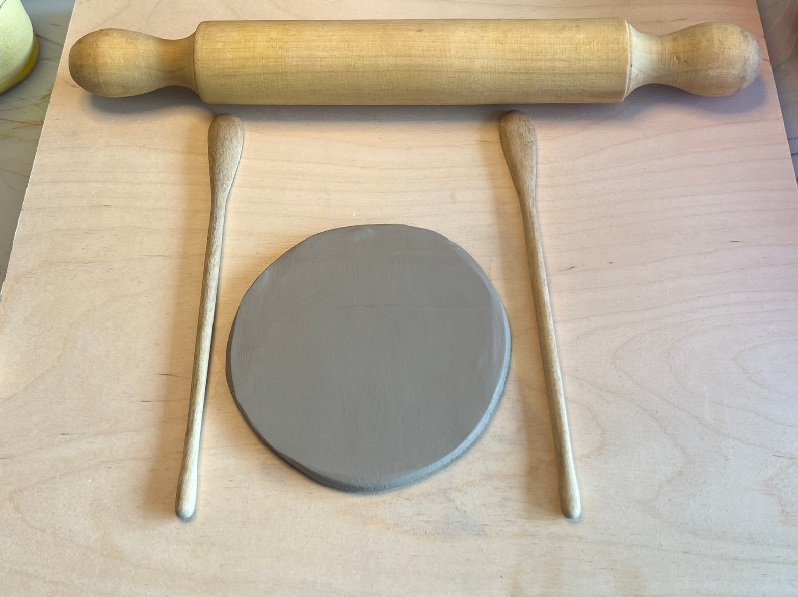
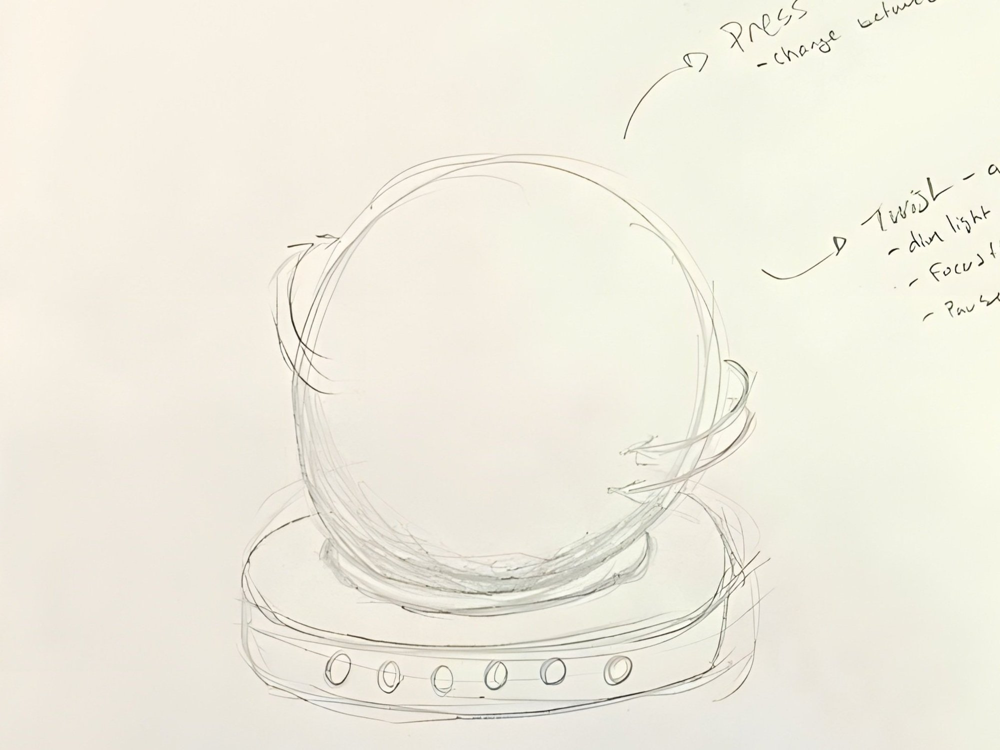
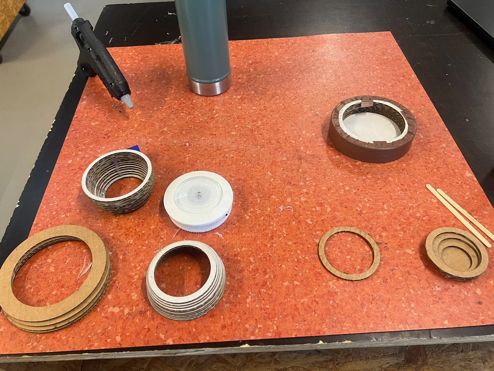
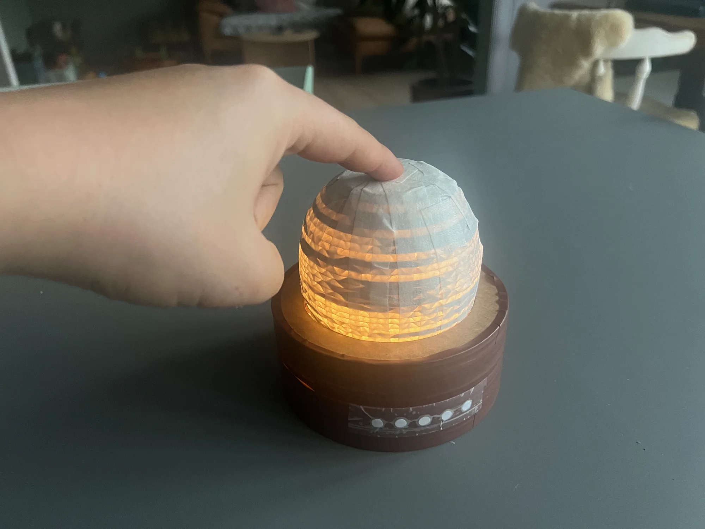
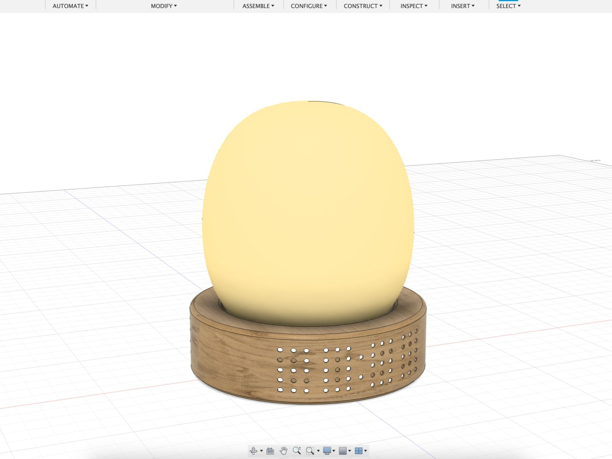
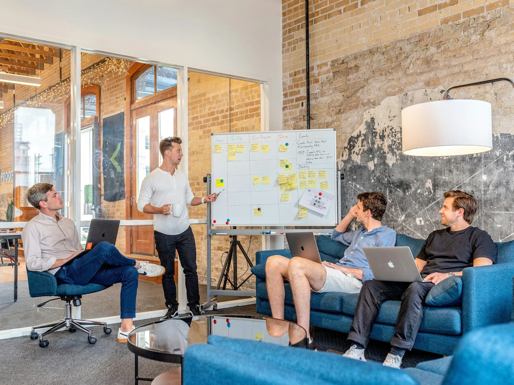

## Challenge

the clock lives inside the distraction

How do you stay focused while learning a new skill? To find out first-hand, I spent three weeks learning clay pottery at home — ending every session with meticulous notes on what helped and what broke my focus. The patterns were clear:

- **Planning sessions in advance** (when, and for how long) made it easier to start and to stop
- My phone was the single biggest distraction
- Keeping track of time *without* the phone was nearly impossible
- Alarms helped — but gave no sense of **time remaining** at a glance

*Three weeks of pottery, logged session by session — the research method was living the problem.*

## Sketching

ambient time

The insight: I needed time to be **ambient** — visible without being demanding — and a reason to put the phone in another room.

Inspired by a small battery lamp that switches off after a set time, I sketched a desk lamp with a built-in timer: **twist to set the session length, press to start.** As time passes, the light gradually dims; when it turns off, the session is over. You always know roughly where you are — without ever checking a clock.

*Sketches translating the field notes into a twist-and-press timer lamp.*

## Prototyping

cardboard slices, fast iteration

I built a working mock-up around the battery lamp that inspired the idea, stacking laser-cut cardboard layers like 3D-print slices — much faster to iterate than actual printing. The base's inner diameter matches the donor lamp, so the electronics simply nest inside.

*Laser-cut layers stack like print slices — a full shape iteration takes minutes, not hours.*

## Testing

at the desk it was designed for

I used the prototype through my own study sessions to evaluate the twist-and-press controls and the overall shape and size on a real desk.

[Watch the prototype in action ↗](https://youtu.be/2yNAaNFDY7A)

*The prototype in use during a real study session.*

## CAD model

pinning down the form

To resolve proportions and materials, I modelled the lamp in CAD — partly for a better representation of the idea, and partly because I couldn't help myself.

*The CAD model resolved proportions, materials, and the twist mechanism's feel.*

## Status & reflection

This is a work in progress. The next milestone is a functional prototype — light, timer, and controls working together — to test with other learners and iterate from real feedback.

What the project has taught me so far: **being your own research subject is a fast route to honest insights — and a risky one.** Autoethnography surfaced needs I would never have found in an interview, but the next iteration has to earn its keep with learners who aren't me.

*Where the concept is heading: warm, quiet, and dimming toward done.*
