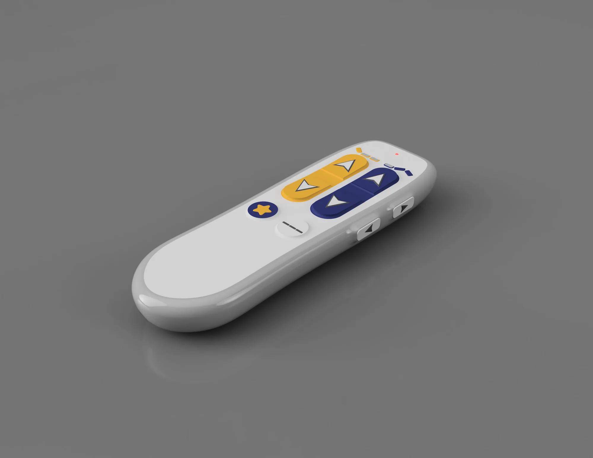
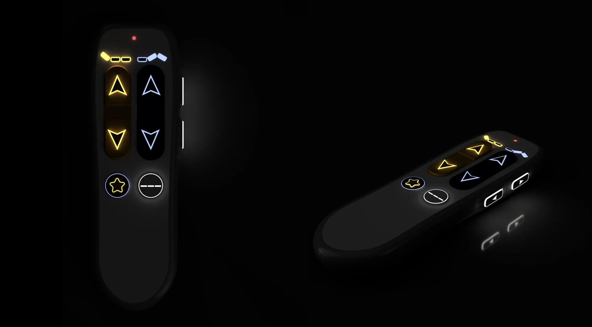
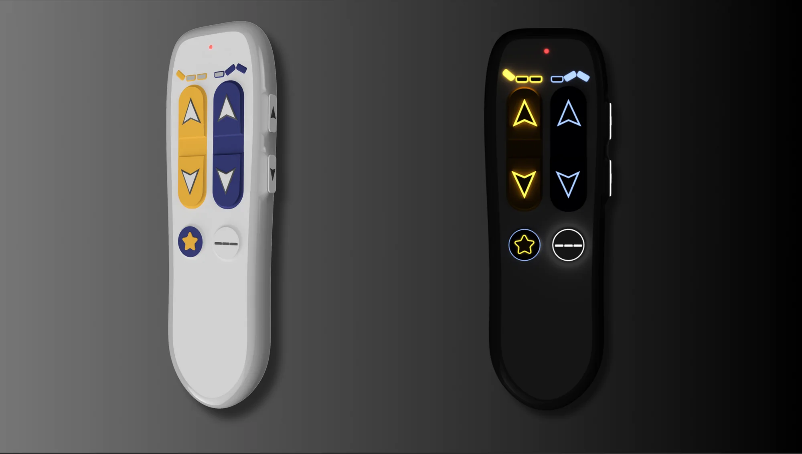

## Challenge

give residents back the controls

Care homes face a growing population of senior citizens — and fewer hands to care for them. LINAK, the company behind the actuators in countless hospital beds, asked a three-week master's team: **how do we redesign the bed remote so citizens can operate it themselves?**

Today the remotes are used almost exclusively by caregivers. Giving citizens back that control means designing for arthritis, low vision, and unfamiliarity with technology — all at once.

## Desk research

mapping grip, sight, and memory barriers

We started by mapping the impairments that stand between senior citizens and the current remote — grip strength, dexterity, eyesight, cognition — and surveyed existing remotes, accessibility controllers, and assistive devices for what already works.

*The impairment map became our checklist: every design decision had to pass all four barriers.*

## Fieldwork

in care homes, simplicity wins

We visited two care homes and interviewed caregivers — and, on one visit, two citizens — to see how remotes are actually used in context. The barriers were consistent:

- **Low tactility** — buttons hard to feel and distinguish
- **Confusing layout** with too many functions
- Too big or too wide for smaller hands
- **Low contrast** — hard to read, impossible to find in the dark

One telling insight: recliner-chair remotes with a simple up/down layout *were* used by citizens. **Simplicity works** — and it set the bar for every concept that followed.

*Field notes from the care home visits — the recliner remote observation changed the project's direction.*

## Sketching

wide before narrowing

With the field insights as constraints, we sketched broadly — shapes, layouts, functions, materials, and button types that could make the remote self-explanatory at first touch.

*From broad shape studies to detailed button and grip explorations.*

## Prototyping

objects you can hold beat renders

We turned the strongest sketches into physical prototypes and experimented hands-on with shapes, sizes, button types, and layouts — cheap, fast, and tangible. Holding the options made the trade-offs obvious in a way screens never could.

*Foam and cardboard made every idea testable within hours.*

## Testing

ski gloves and closed eyes

We ran a workshop where design students pushed the prototypes to their limits under simulated impairments:

- **Ski gloves** to simulate arthritis and reduced dexterity
- **Eyes closed** to simulate visual impairment, navigating by touch alone
- **Think-aloud** walkthroughs of every function

We also consulted an expert on introducing technology into healthcare systems to pressure-test the concept against real-world constraints. The surviving design choices — rocker buttons, narrow waist, radical simplicity — went straight into CAD.

*If you can operate it in ski gloves with your eyes closed, arthritis and low vision won't stop you.*

## CAD & print

into someone's hand

I consolidated everything we learned — layout, functions, shape — into a detailed 3D model: large, high-contrast rocker buttons; a narrow, grippable waist; and only the functions citizens actually need.

*Modelling resolved button travel, wall thickness, and the waist profile.*

Printing the model made the design real: we could hand it to people, watch their grip, and collect far more concrete feedback than any render allows.

*The printed model, sized for smaller hands and findable in the dark.*

## Outcome & reflection

A remote concept that senior citizens can find, hold, and operate on their own — supporting LINAK's goal of preparing elderly care for a future with fewer hands, and giving citizens more agency over their own comfort.

What the project taught me: **accessibility constraints sharpen design rather than limit it.** Designing for the hardest case — gloved hands, closed eyes — produced a remote that is simply better for everyone. And nothing accelerates honest feedback like a physical object someone can pick up and judge with their own hands.
