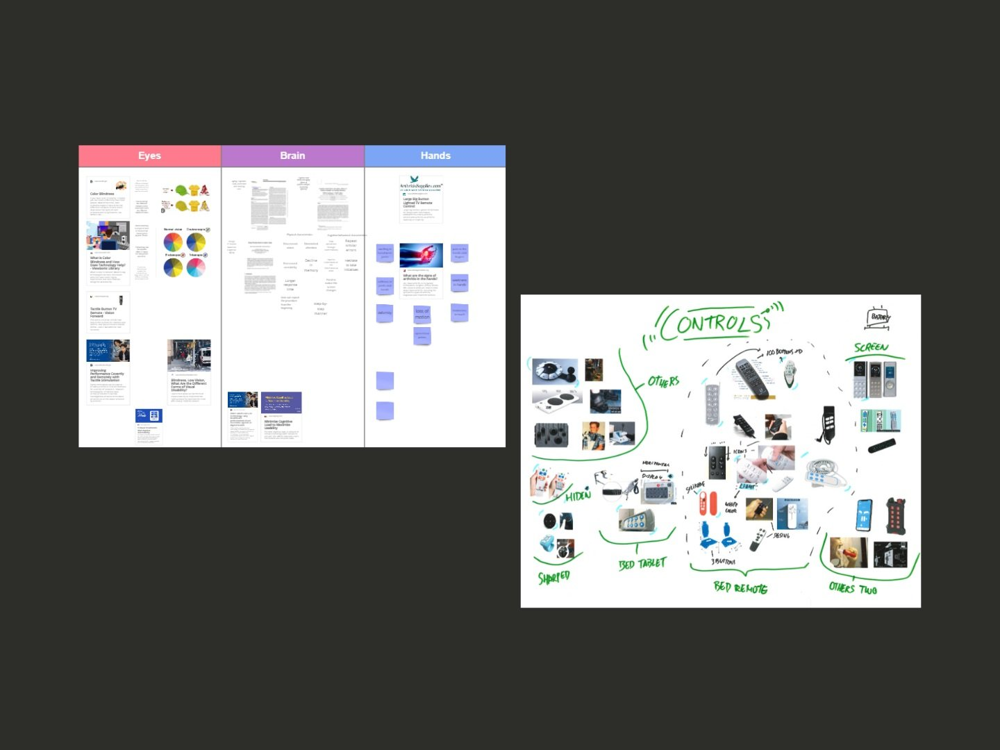
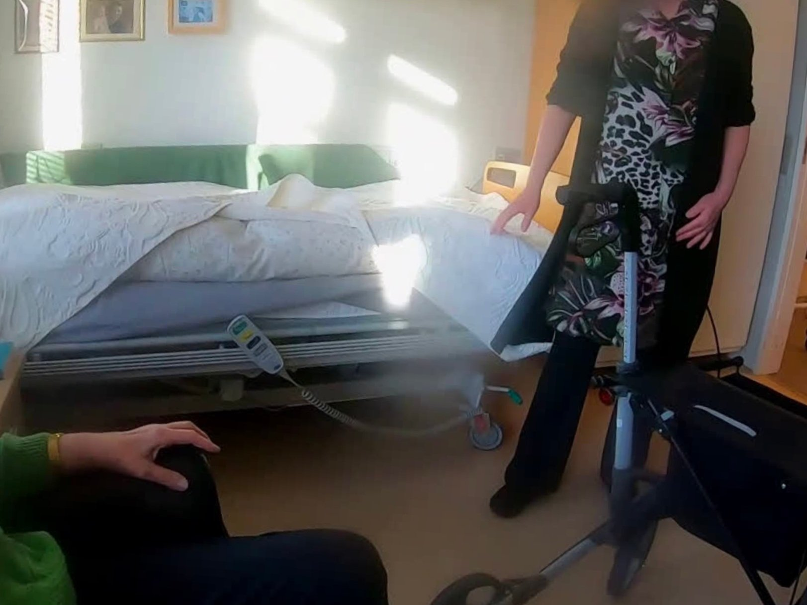
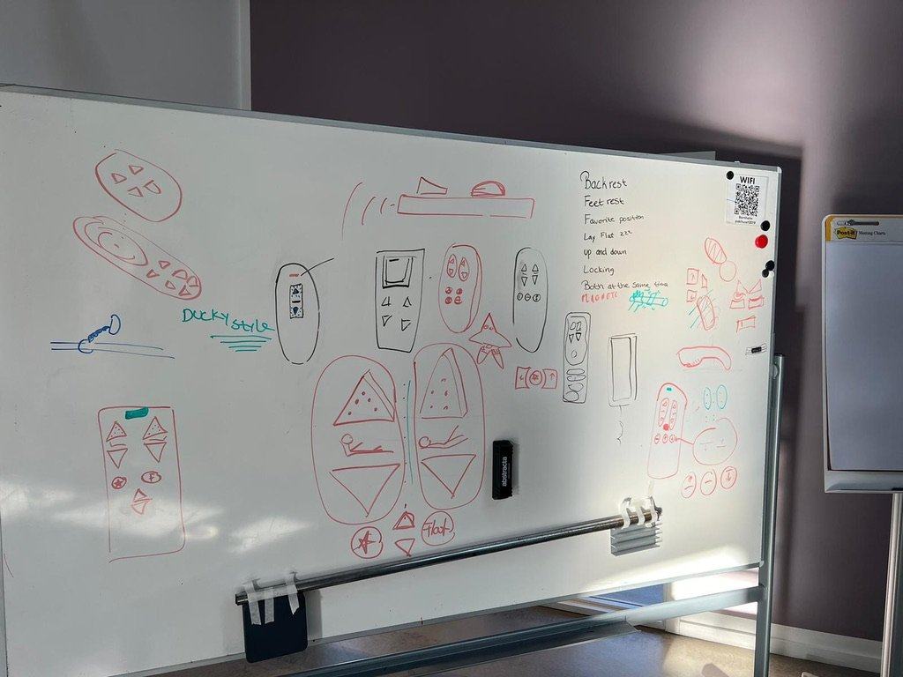
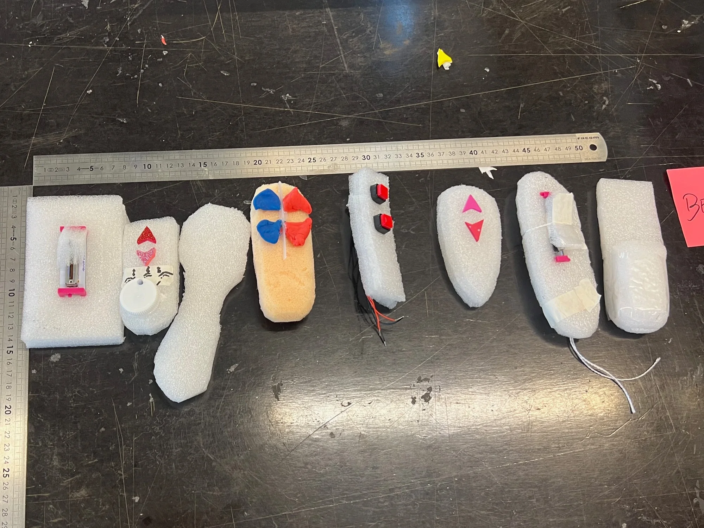
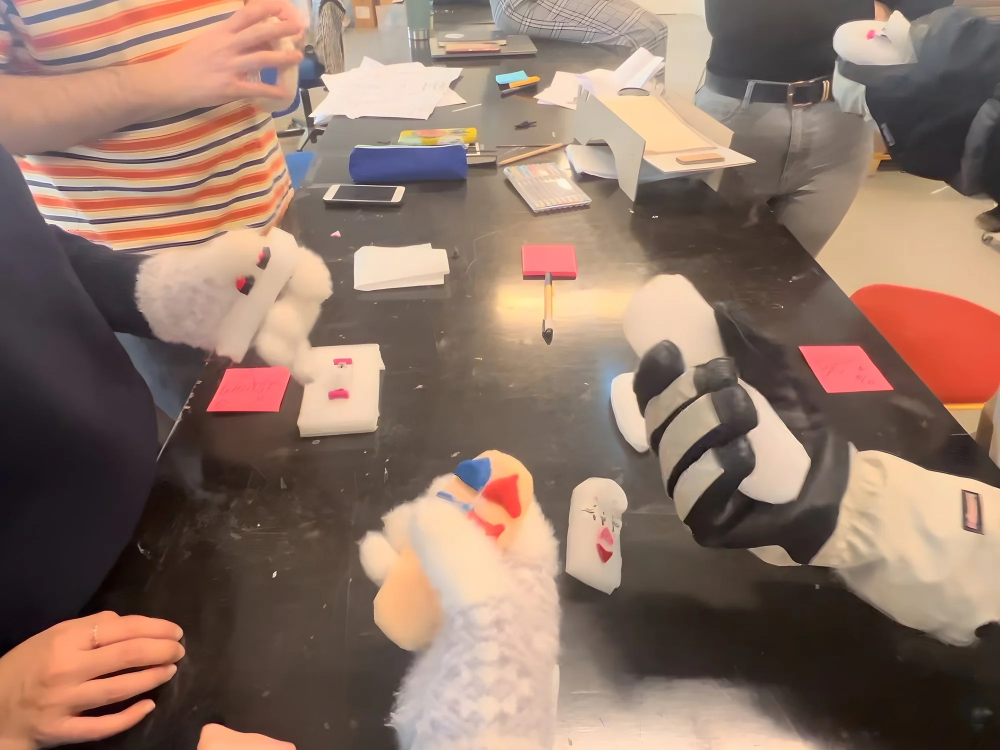
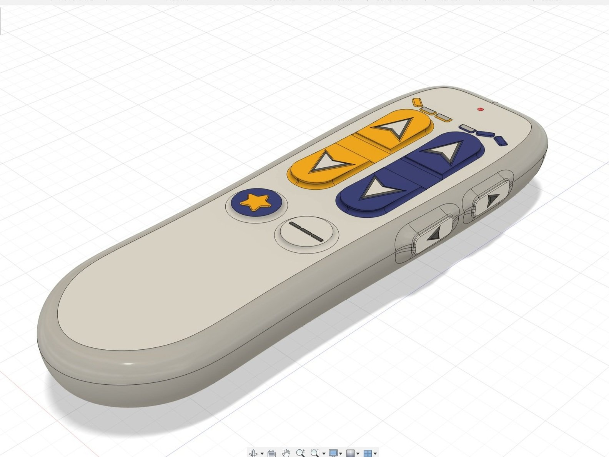
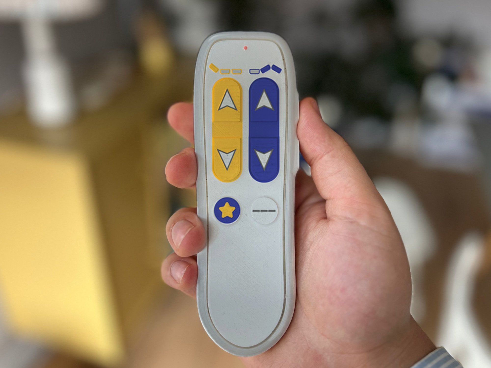

## The challenge

Care homes face a growing population of senior citizens — and fewer hands to care for them. LINAK, the company behind the actuators in countless hospital beds, asked a three-week master's team: **how do we redesign the bed remote so citizens can operate it themselves?**

Today the remotes are used almost exclusively by caregivers. Giving citizens back that control means designing for arthritis, low vision, and unfamiliarity with technology — all at once.

## Desk research

We started by mapping the impairments that stand between senior citizens and the current remote — grip strength, dexterity, eyesight, cognition — and surveyed existing remotes, accessibility controllers, and assistive devices for what already works.

## Field work

We visited two care homes and interviewed caregivers — and, on one visit, two citizens — to see how remotes are actually used in context. The barriers were consistent:

- **Low tactility** — buttons hard to feel and distinguish
- **Confusing layout** with too many functions
- Too big or too wide for smaller hands
- **Low contrast** — hard to read, impossible to find in the dark

One telling insight: recliner-chair remotes with a simple up/down layout *were* used by citizens. Simplicity works.

## Sketching ideas

With the field insights as constraints, we sketched widely — exploring shapes, layouts, functions, materials, and button types that could make the remote self-explanatory at first touch.

## Prototyping

We turned the strongest sketches into physical prototypes and experimented hands-on with different shapes, sizes, button types, and layouts — cheap, fast, and tangible.

## Testing

We ran a workshop where design students stress-tested the prototypes under simulated impairments:

- **Ski gloves** to simulate arthritis and reduced dexterity
- **Eyes closed** to simulate visual impairment, navigating by touch alone
- **Think-aloud** walkthroughs of every function

We also consulted an expert on introducing technology into healthcare systems to pressure-test the concept against real-world constraints.

## 3D CAD model

I consolidated everything we learned — layout, functions, shape — into a detailed 3D model. Large, high-contrast rocker buttons; a narrow, grippable waist; and only the functions citizens actually need.

## 3D printed & in hand

Printing the model made the design real: we could hand it to people, watch their grip, and collect far more concrete feedback than any render allows.

## Outcome

A remote concept that senior citizens can find, hold, and operate on their own — supporting LINAK's goal of preparing elderly care for a future with fewer hands, and giving citizens more agency over their own comfort.
