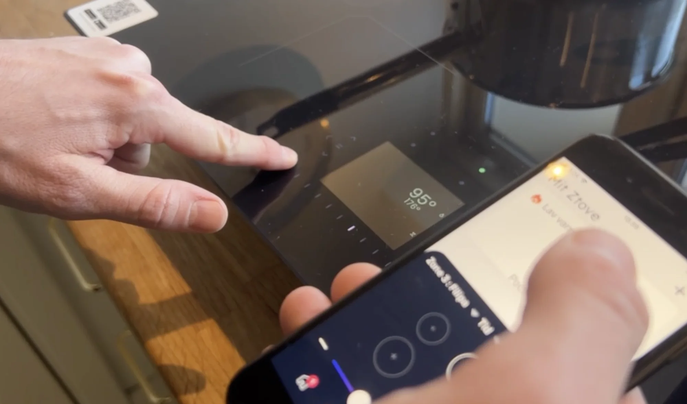
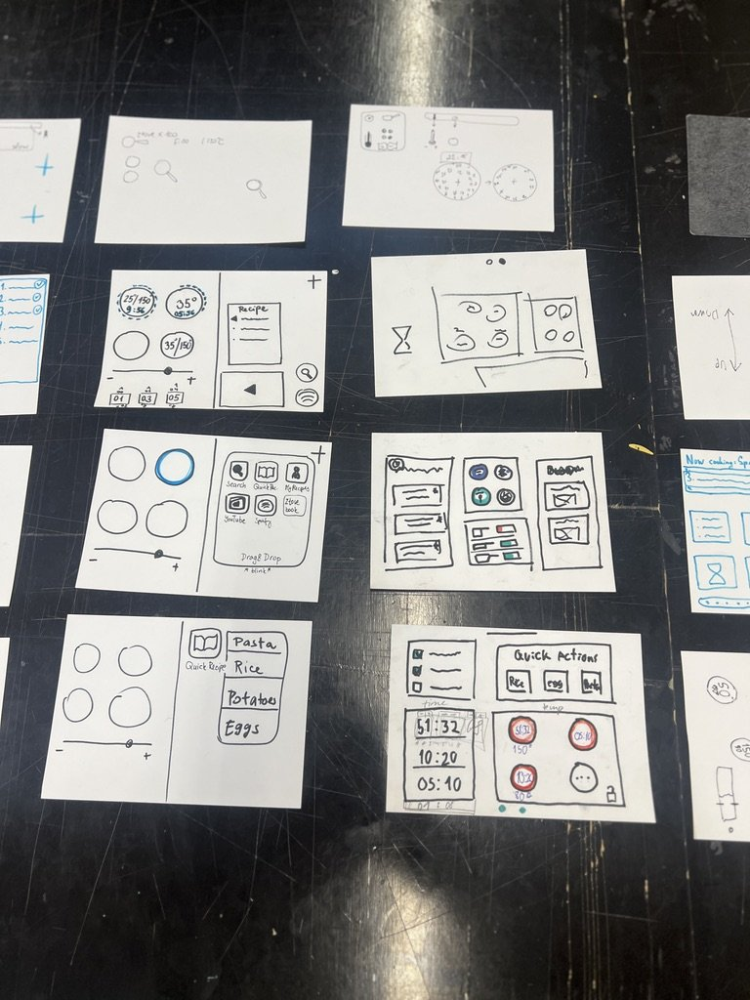
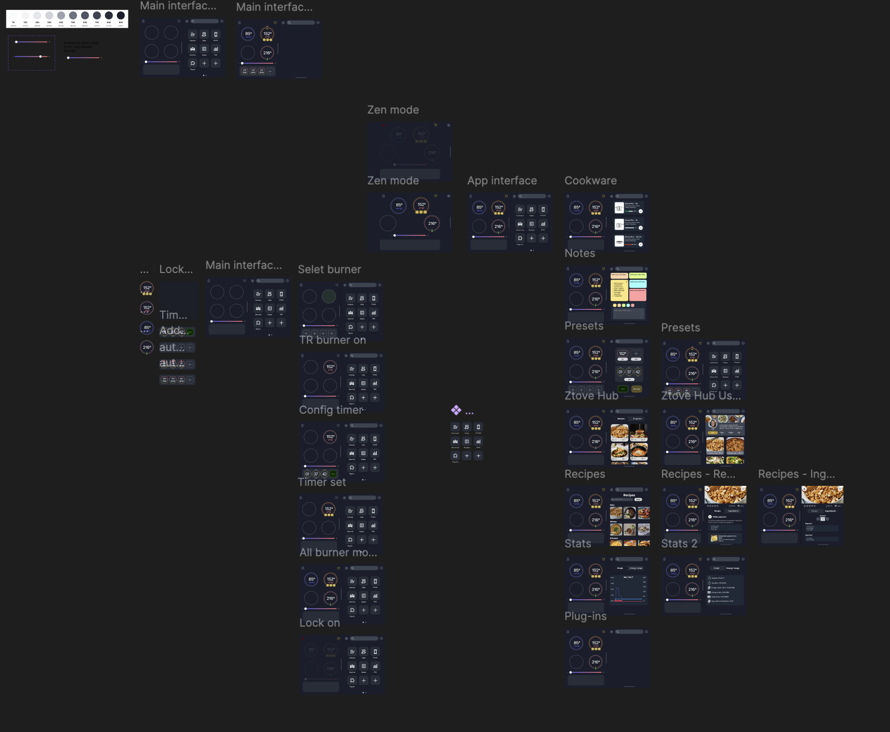
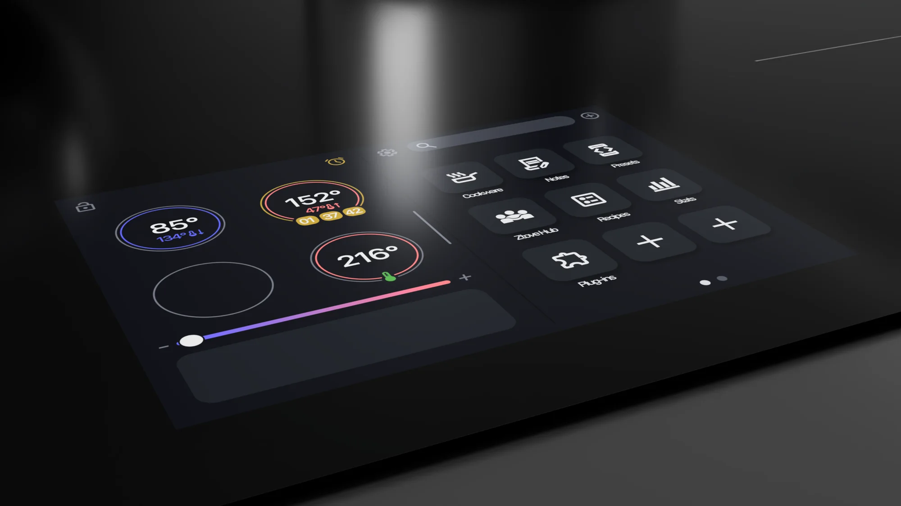
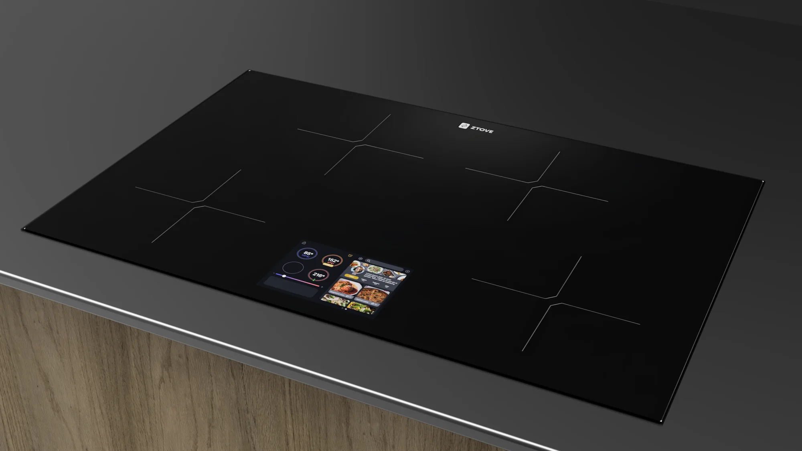
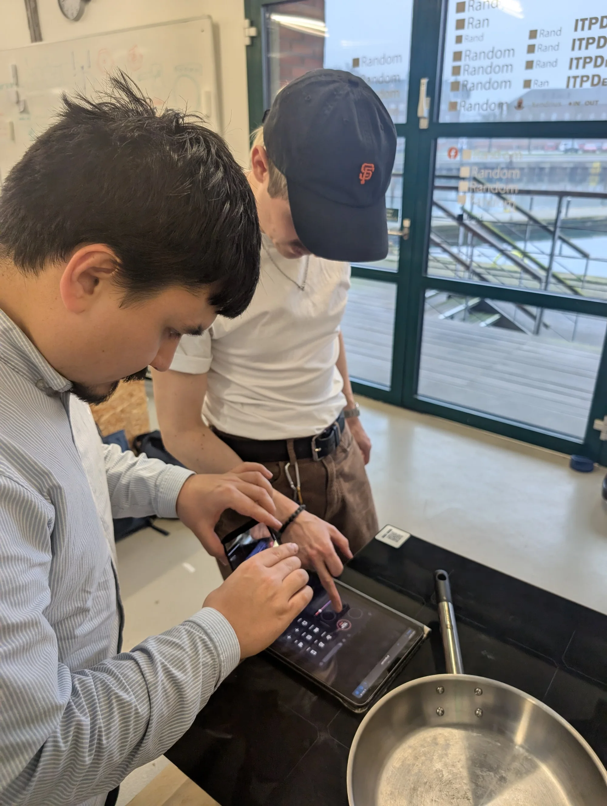
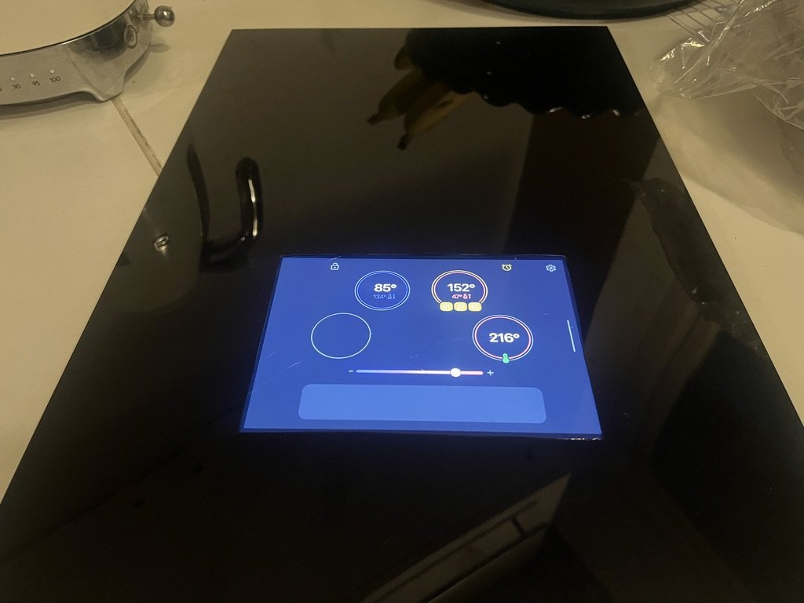
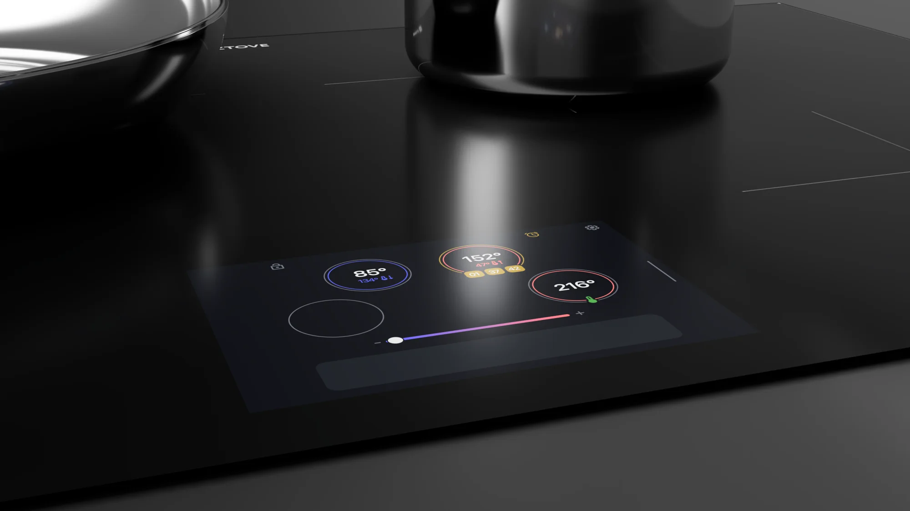

## Challenge

cooking shouldn't be dual-screen

Ztove builds smart induction cooktops with precise, automated temperature control. But using them meant **juggling two interfaces**: the stove's built-in display for some tasks, a phone app for others. Users lost track of where a function lived — right at the moment their hands were full.

The goal: explore how the whole cooking flow could live in one place, directly on the stove.

*The starting point: essential controls split between the stove and this app.*

## Research

people already tried to touch the stove

Observations, interviews, and participatory workshops with users surfaced one recurring expectation: **people instinctively tried to touch the stove's display.** It looked touchable — it just wasn't.

That insight set the direction: honor the affordance users already perceived. Move functionality out of the phone and onto a touch-responsive display built into the cooktop, so the phone becomes optional.

*Concept sketches from the participatory workshops.*

## Prototyping

the flow where the hands already are

I designed the touchscreen layout and built an interactive prototype in Figma around the most common tasks — boiling, simmering, and timing. From the stove itself, users could:

- Adjust temperature with a swipe
- Follow step-by-step cooking programs
- Get visual cues when a step needs attention

*The interactive Figma prototype, built around the most frequent cooking tasks.*

*Task flows: boiling with automatic temperature hold, and step-by-step program guidance.*

## Testing

nobody asked how it works

We tested the prototype in a cooking-workshop setting, mounted where the real display would sit. Users reached out and tapped the screen without prompting — confirming the core assumption.

> Having the cooking steps and the controls in the same place noticeably reduced cognitive load — the confusion of "dual-screening" between stove and phone disappeared.

*Workshop tests with the prototype mounted where the real display would sit.*

The validated flows and screen placement fed directly into the hardware question: could this actually ship?

## Hardware

from screen to cooktop glass

To ground the concept, I modelled the cooktop in 3D CAD with the touchscreen integrated into the glass surface — assessing ergonomics, reach, and safety while cooking, and visualizing how the interface could actually ship.

*The display integrated into the glass, positioned for reach without leaning over hot zones.*

## Outcome & reflection

The concept turns the stove into a single, self-contained cooking companion — smart technology folded into everyday cooking habits instead of layered on top of them.

What the project taught me: **when users keep "misusing" a product the same way, that's not an error — it's a design brief.** People tapping a non-touch display told us exactly what the product wanted to become. Next steps: refine the display's visual design, explore how different types of cooks use it, and validate with a high-fidelity prototype.
