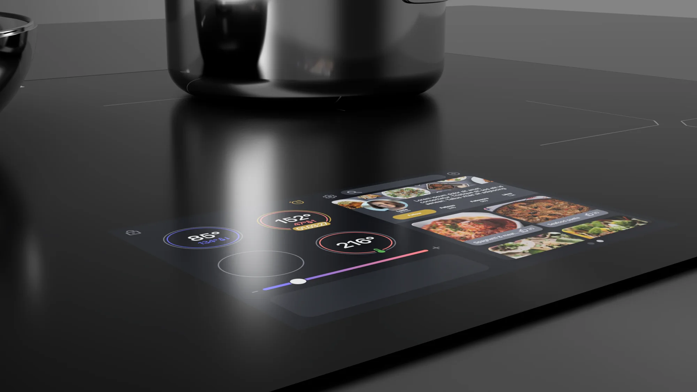

## The challenge

Ztove builds smart induction cooktops with precise, automated temperature control. But using them meant **juggling two interfaces**: the stove's built-in display for some tasks, a phone app for others. Users lost track of where a function lived — right at the moment their hands were full.

The goal: explore how the whole cooking flow could live in one place, directly on the stove.

## Research & sketching

Observations, interviews, and participatory workshops with users surfaced one recurring expectation: **people instinctively tried to touch the stove's display.** It looked touchable — it just wasn't.

That insight set the direction: move functionality out of the phone and onto a touch-responsive display built into the cooktop, so the phone becomes optional.

## Prototyping the interface

I designed the touchscreen layout and built an interactive prototype in Figma around the most common tasks — boiling, simmering, and timing. From the stove itself, users could:

- Adjust temperature with a swipe
- Follow step-by-step cooking programs
- Get visual cues when a step needs attention

## Testing in the kitchen

We tested the prototype in a cooking-workshop setting, mounted where the real display would sit. Users reached out and tapped the screen without prompting — confirming the core assumption.

> Having the cooking steps and the controls in the same place noticeably reduced cognitive load — the confusion of "dual-screening" between stove and phone disappeared.

## From screen to hardware

To ground the concept, I modelled the cooktop in 3D CAD with the touchscreen integrated into the glass surface — assessing ergonomics, reach, and safety while cooking, and visualizing how the interface could actually ship.

## Outcome & next steps

The concept turns the stove into a single, self-contained cooking companion. Next steps: refine the visual design of the display, explore how different types of cooks would use it, and validate with a high-fidelity prototype — bridging smart technology with everyday cooking habits in a more intuitive, embodied way.

