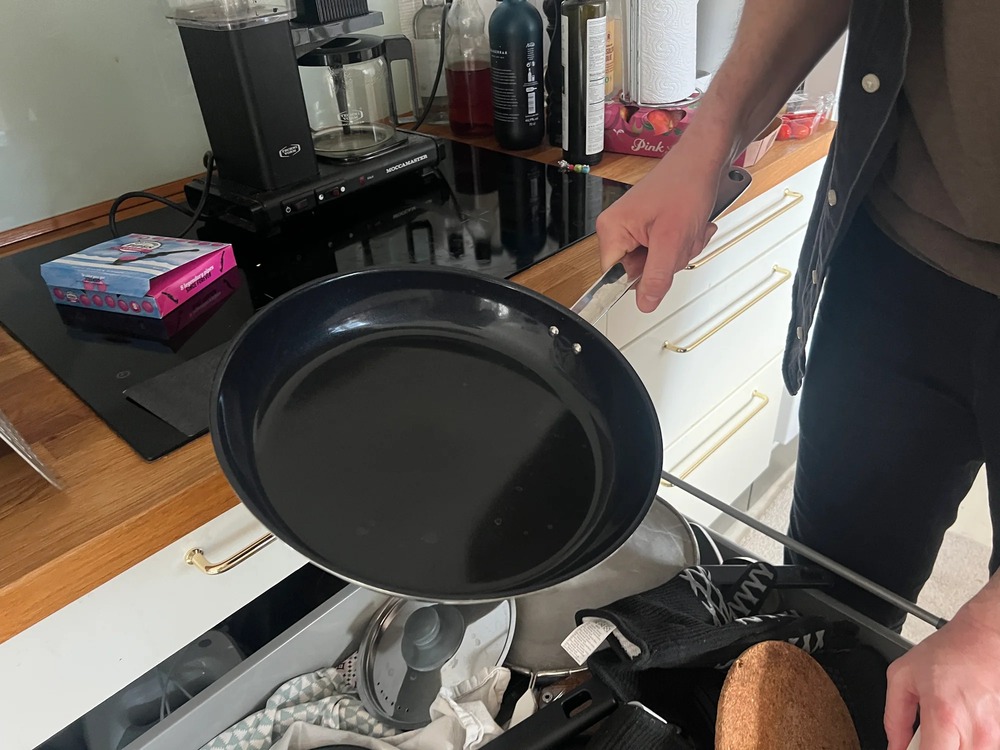
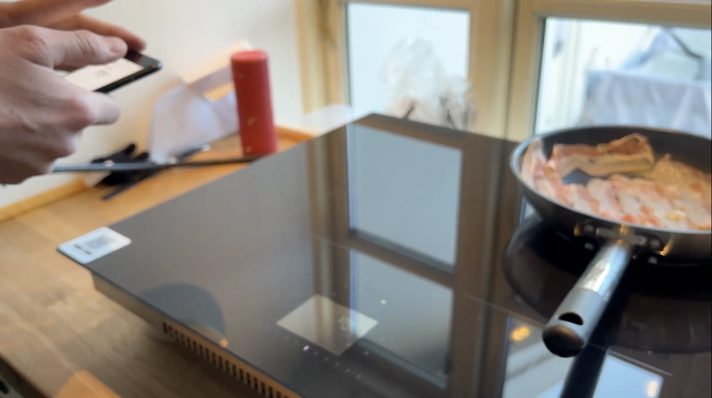
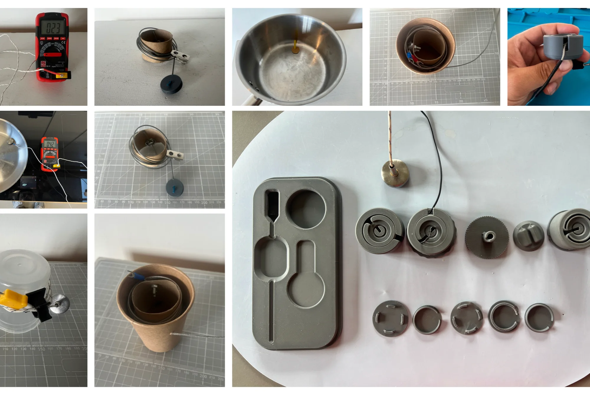
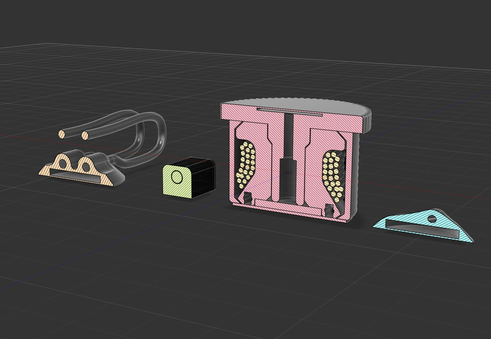
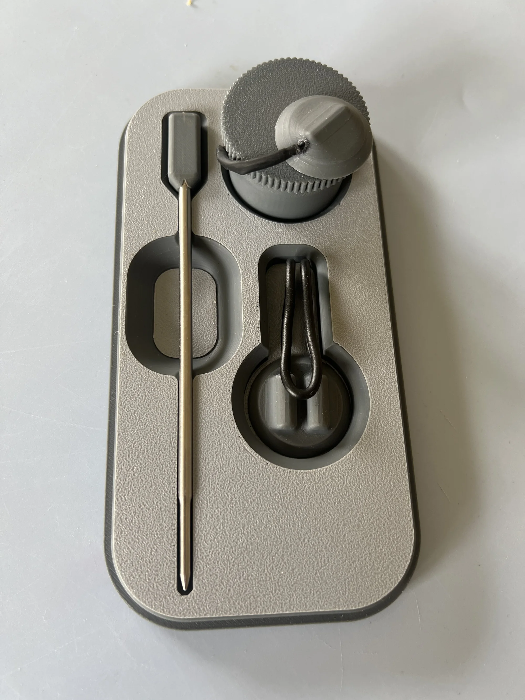
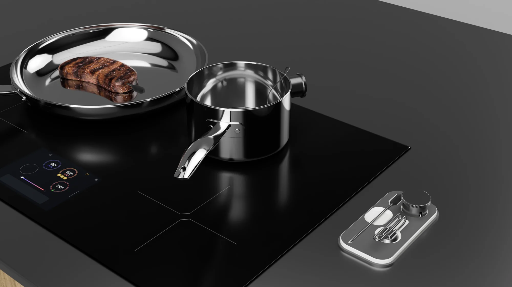

## Challenge

Make any pan a smart pan

Ztove's cooktops can hold a pan at an exact temperature automatically — but only with Ztove's own cookware. For everyone else, the smartest features stay out of reach.

**My master's thesis asked one question: what if any pan could become a smart pan?** The harder, hidden question was how to add technology to cooking without breaking the craft people already love.

*Fieldwork started with the cookware people refuse to give up.*

## Research

In real kitchens, senses beat screens

I observed home cooks in their own kitchens and talked through their routines. Two findings shaped everything that followed:

- Cooks trust their **senses** — smell, sound, touch — far more than displays or apps.
- A smart device only earns its place if it demands **no extra attention and no extra space**.

That set the design constraint: no screen, no app-first flow. The sensor had to disappear into the tools cooks already use.

*Observation sessions in participants' kitchens grounded every later decision.*

## Prototyping

A sensor that disappears

The constraint pointed to a magnetic temperature probe that attaches to the bottom of any pot or pan. I built several working versions — varying shape, size, and attachment mechanism — using thermocouples, 3D-printed housings, and a lot of real cooking.

*Iterations moved from bare thermocouple rigs to printed housings with embedded magnets.*

Each round of cooking with a prototype fed directly into the next: the probe got slimmer, the magnet stronger, the attachment one-handed.

## Testing

Home cooks forgot it was there

I put the prototypes in the hands of home cooks and let them do what they always do. The feedback was consistent:

> The best compliment the probe received was being ignored — it never got in the way of stirring, flipping, or moving pans.

- **Quiet by default** — participants wanted it working in the background, only signalling when something needed attention, like a sauce reaching temperature.
- **Instantly understood** — snap it on, cook as usual. No manual needed.

These sessions confirmed the concept and defined the final form factor to resolve in CAD.

## CAD model

Resolving the details

I modelled the probe and its charging tray in full detail — internals, tolerances, materials, and how the pair would look and feel on a kitchen counter. The model became the key tool for communicating the concept to Ztove and to test participants.

*The cross-section resolved sensor placement, magnet seating, and sealing.*

*The charging tray gives the probe a home on the counter — and a reason to be found again.*

## Outcome & reflection

The result is a concept that unlocks Ztove's precise temperature control for **any cookware** — no special pots needed. Developed into a detailed CAD concept and tested with home cooks, it points toward a family of smart kitchen tools that support natural cooking behavior.

What the project taught me: **the strongest smart products are the ones that ask for the least.** Designing for embodied, sensory practice meant measuring success by how little the technology interrupted — a lens I now bring to every product I work on. Next step: deeper integration with Ztove's system, and testing the probe over weeks of everyday cooking rather than single sessions.
