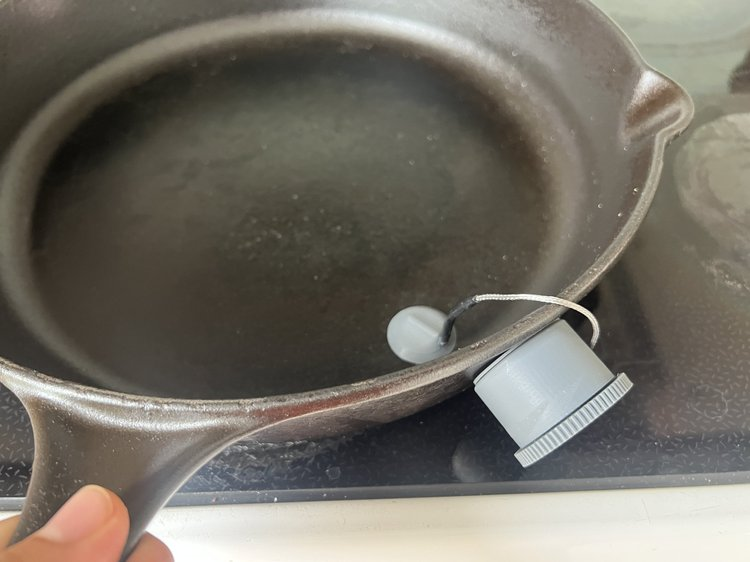

## The challenge

Ztove's induction cooktops can hold a pan at an exact temperature automatically — but only with Ztove's own proprietary cookware. That locks the smartest features away from the pots and pans people already own and love.

**This master's thesis project asked a simple question: what if any pan could become a smart pan?**

## Exploration & ideation

I started in real kitchens — observing people cook and talking through their routines. Two things stood out:

- Cooks rely on familiar tools and their senses — smell, sound, and touch — far more than on displays or apps.
- A smart device would only fit in if it demanded **no extra attention and no extra space**.

Early sketches therefore focused on something small and self-effacing: a sensor that quietly joins the cookware instead of replacing it.

## Prototyping

The concept became a magnetic temperature probe that attaches to the bottom of any pot or pan. I built and tested several working versions — varying the shape, size, and attachment mechanism — using thermocouples, 3D-printed housings, and plenty of real cooking.

## Testing with home cooks

I put the prototypes in the hands of home cooks and let them cook. The feedback was consistent:

- Small enough to ignore — the probe never got in the way of stirring, flipping, or moving pans.
- **Quiet by default** — users preferred it working in the background, only signalling when something needed attention, like a sauce reaching the right temperature.

## 3D CAD model

To refine the design, I modelled the probe and its charging tray in detail — resolving internals, tolerances, and how it would look and feel in a real kitchen. The model also became the key tool for communicating the concept to Ztove and test participants.

## Outcome & next steps

The result is a concept that unlocks Ztove's precise temperature control for any cookware — no special pots needed. The next step is deeper integration with Ztove's system and exploring a family of smart kitchen tools that support natural cooking behavior: **technology that helps, without taking over.**

